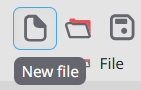
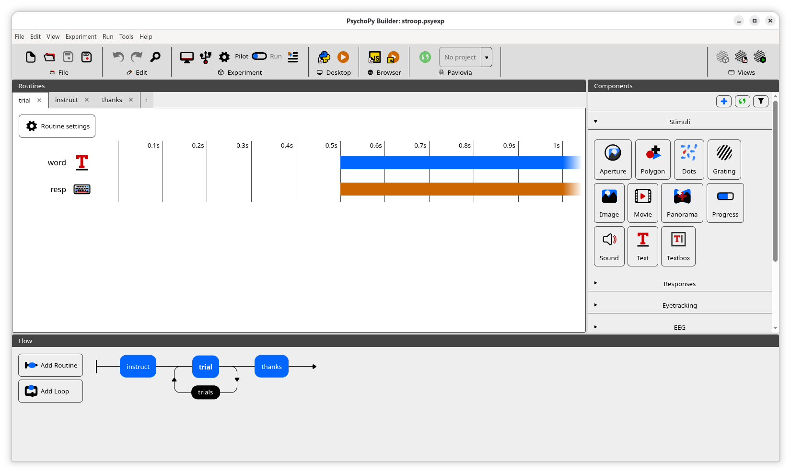
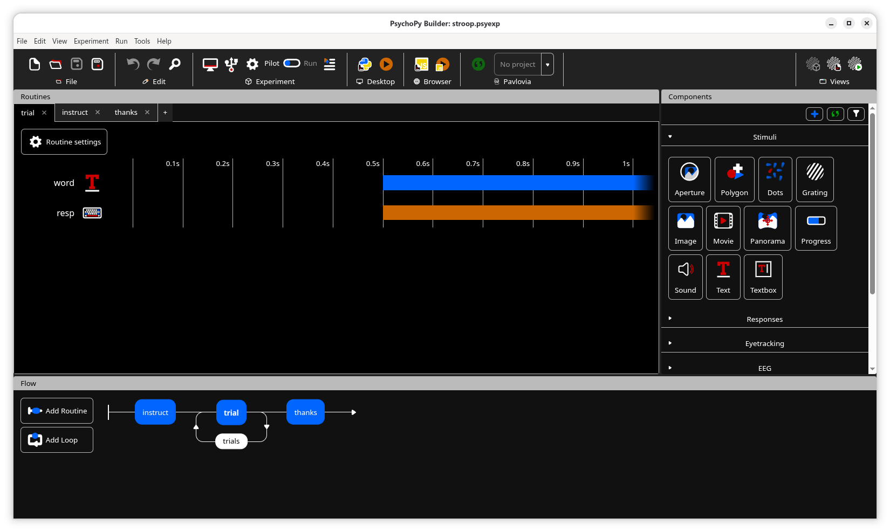
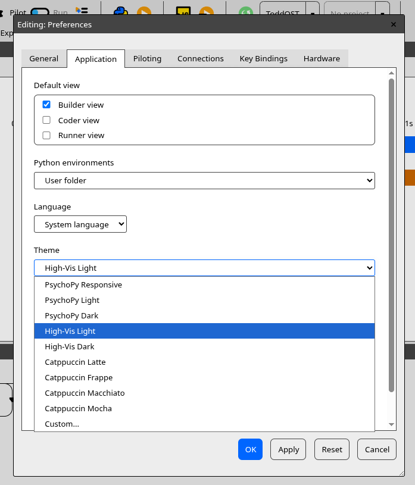
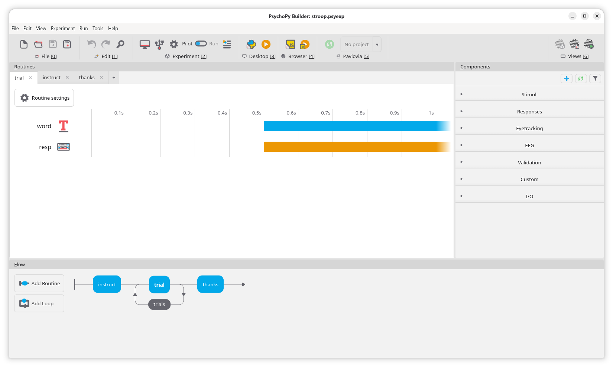
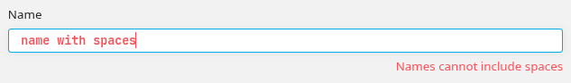
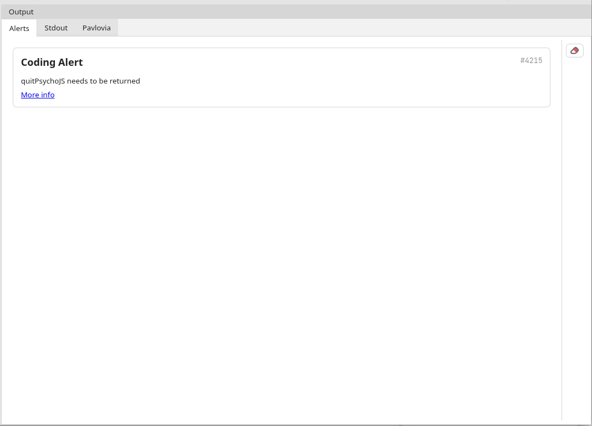

Accessibility in PsychoPy
-------------------------------

.. note::
    This page applies specifically to PsychoPy Studio, not PsychoPy Standalone. For users with accessibility requirements we strongly recommend switching to PsychoPy Studio.

    Accessibility is one of many reasons we chose to create PsychoPy Studio, which is a full rebuild of the |PsychoPy| app using modern web-based UI toolkits (Svelte/Electron). PsychoPy Standalone is built in wxPython, which is severely limited in creating bespoke interfaces, so several parts of the app (espcially Builder) had to be manually drawn. Creating elements this way means they don't benefit from tab navigation, tooltips and other accessibility features in the same way as native elements. In PsychoPy Studio, the interface is HTML, which is infinitely flexible and allows us to recreate the same bespoke interface without sacrificing accessibility features.

Accessibility is vital to the mission statement of |PsychoPy|; if it's not accessible, then it's not "easy enough for teaching" or "free for everyone".

Tooltips
===============================

Tooltips are an essential part of modern apps; they allow for both simple labels to be expanded upon in more detail, and for buttons indicated just by an icon to be parsed by screen readers. Any time a button is used in PsychoPy Studio without a text label, hovering over the button with the mouse or focusing it with Tab will display a tooltip describing the button:

In some cases, simple labels can similarly be hovered or focused to show a more in-depth description, as with the names of parameters in Components.

High-visibility themes
===============================

The high-visibility themes ("High-Vis Light" and "Hi-Vis Dark", for light and dark mode respectively) use high contrast colors to make controls as visible as possible to users with limited vision. In builder view, they look like this:

To select these, go to File -> Preferences (from Builder, Coder or Runner), select the "Application" tab and then choose them from the dropdown under "Theme":

Themes are also customisable; the user can create a .css file defining their preferred theme colors, then select it in their preferences. This allows for members of the community to create and distribute theme files to meet more specific accessibility needs.

Keyboard-only navigation
===============================

All clickable elements in PsychoPy Studio are (or should be; please report any which aren't on our `GitHub issues <https://github.com/psychopy/psychopy-studio>`_!), able to receive focus via the keyboard. This means that the app is navigable by keyboard alone. Critically, unlike PsychoPy Standalone, this includes more bespoke views like the Flow and Routines panels.

To navigate using the keyboard, simply press Tab to move focus to the next button on the page (from top left to bottom right), and press Shift+Tab to move focus to the previous button. Pressing Enter will have the same effect as clicking that button, pressing the Menu key will have the same effect as right clicking that button, and pressing Escape will close any open context menus.

Panel skipping
~~~~~~~~~~~~~~~~~~~~~~~~~~~~~~~

There are a lot of buttons in each view, so to make navigation less tedious, we have included some shortcuts to jump focus to a particular panel. If you hold down the Alt key, panels' labels will change to show which key to press to jump focus to it, like so:

So, for example, to skip to the Routines panel, you would press Alt+R. This would select the first item in this panel (in this example, the "trial" tab). Using Alt + a number key will skip you to the matching section of the ribbon (e.g. Alt+0 skips to the File section).

Tab trapping
~~~~~~~~~~~~~~~~~~~~~~~~~~~~~~~

Note that any multi-line code controls (such as open files in Coder view or the tabs of a Code Component) can function as "tab traps" - because you can enter them using the Tab key, but once inside pressing Tab or Shift+Tab will indent/dedent the text. To get out of these elements, you can use Ctrl+M (Ctrl+Shift+M on Mac) to toggle `"tab trapping" <https://github.com/Microsoft/monaco-editor/wiki/Monaco-Editor-Accessibility-Guide#tab-trapping>`_, allowing you to once again use Tab or Shift+Tab for navigation.

Touchscreen-friendly buttons
===============================

Touchscreen support on laptops and desktop computers is becoming increasingly common, which provides an easier way for users with limited fine motor control to interact with software. Buttons in PsychoPy Studio are all presented with enough padding that they are touchscreen-clickable; we test this using the `Lighthouse <https://developer.chrome.com/docs/lighthouse/overview/>`_ developer tool in Google Chrome, which alerts us when an element on the screen is too small for touchscreen devices.

Interruptions
===============================

In addition to being annoying, popup dialogs which can't be dismissed can present real challenges for users with attention deficit disorders and anyone relying on a screen reader. 

PsychoPy Studio uses popups minimally. Errors in the value of a Component are displayed as red text below the relevant field, like so:

Warnings about the experiment (triggered on compile to Python or JS) are sent to the Alerts panel in Runner (which can be cleared by clicking the eraser button in the top right of the panel):

Where we do use popups (such as prompting the user to enter a commit message when syncing to Pavlovia), we always offers a Close/Cancel/X button to dismiss them. The one exception is the dialog box which appears while Python and the |PsychoPy| library are being installed, as skipping this process could break the app.

Photosensitivity
===============================

PsychoPy Studio does not, as part of its user interface, use any rapidly flashing controls which might pose a risk to users with photosensitive epilepsy. However, it is worth noting that **PsychoPy Studio does not prevent you from presenting potentially harmful stimuli in your experiment**, so you should always check that your stimuli aren't potentially harmful.
